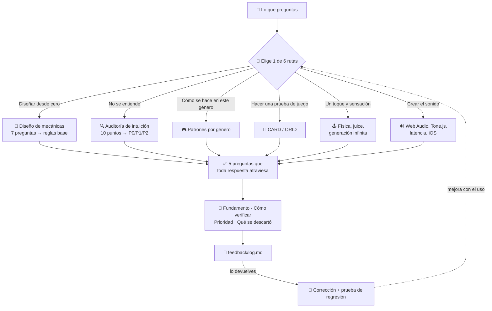

# ⚡ intuitive-game-design

[](https://claude.com/claude-code)
[](#-funciona-de-verdad)
[](#-intuitive-game-design)

[English](README.md) · [日本語](README.ja.md) · [简体中文](README.zh-CN.md) · **Español** · [한국어](README.ko.md)

> **Crea un juego que nadie necesita que le expliquen: desde la primera idea hasta el sonido que hace.**

---

## 🔰 ¿Qué es esto?

Piensa en una puerta. Una buena puerta te dice si empujar o tirar solo por su forma: una placa plana significa empujar, una manija significa tirar. Cuando una puerta necesita un cartel que diga EMPUJE, esa puerta ya falló.

Con los juegos pasa lo mismo. Este skill convierte «se entiende cuando te lo explico» en «se entiende sin explicar nada», y después te ayuda a pulir cómo se siente al tocarlo y a que suene de verdad.

---

## 📐 Arquitectura



---

## ✨ 3 puntos clave

### 🎯 Convierte «intuitivo» en algo que se puede comprobar
Cinco preguntas transforman una palabra vaga en un veredicto: si alguien que juega por primera vez actúa en 30 segundos, dónde se separan la intención y la percepción, si estás pidiendo más de 4 cosas nuevas a la vez, si la profundidad viene del acoplamiento y no de la cantidad, y si están las tres capas de feedback. Cada respuesta incluye fundamento, forma de verificarlo y prioridad P0/P1/P2.

### 🔧 Trae implementaciones que funcionan, no solo consejos
Coyote time y buffer de entrada (la versión que consume los dos temporizadores correctamente), un motor de Web Audio con desbloqueo, límite de voces y planificador anticipado, y un generador de niveles que nunca produce un hueco imposible de pasar. Son justo las partes que todo el mundo reescribe y todo el mundo equivoca en algún detalle.

### 📈 Convierte sus propios fallos en pruebas de regresión
Cada sesión deja siete líneas en `feedback/log.md`. Devuelve ese archivo y un script transforma los fallos confirmados en casos de eval, así lo corregido se queda corregido en lugar de revertirse en silencio.

---

## 🔄 Antes / Después

| | Antes | Después |
|---|---|---|
| «Los jugadores no lo entienden» | Alargar el tutorial | Encontrar dónde está el desajuste real y corregir el diseño |
| «El salto a veces se siente raro» | Ajustar la gravedad a ojo | Coyote time 100–150 ms, buffer 100 ms, código que funciona |
| «Sin sonido solo en iPhone» | Horas buscando, sin ningún error | Orden de diagnóstico: primero el estado `suspended` |
| Propuestas de mejora | 10 ítems, ninguno implementado | P0 señalado, con su forma de verificarlo |
| Puntuación medida en eval | 66% (sin skill) | **97%** en 12 casos |

---

## 🚀 Instalación y uso

**Requisitos previos:** [Claude Code](https://claude.com/claude-code) (o un entorno compatible que cargue skills). Python 3 solo hace falta para los dos scripts opcionales de feedback.

### 🖥️ Patrón A — CLI / terminal

Clona una vez y usa un enlace simbólico para que los cambios se apliquen al instante:

```bash
git clone https://github.com/takaoumehara/intuitive-game-design-skill.git
ln -s "$(pwd)/intuitive-game-design-skill" ~/.claude/skills/intuitive-game-design
```

Si prefieres copiar en lugar de enlazar:

```bash
git clone https://github.com/takaoumehara/intuitive-game-design-skill.git
cp -r intuitive-game-design-skill ~/.claude/skills/intuitive-game-design
```

### 🧩 Patrón B — IDE con IA integrada

Claude Code lee los skills desde dos ubicaciones. Ponlo en el proyecto para compartirlo con tu equipo por git:

```bash
# Disponible en todos los proyectos
~/.claude/skills/intuitive-game-design/

# Solo en este proyecto, se sube al repositorio
<your-project>/.claude/skills/intuitive-game-design/
```

Reinicia Claude Code después de instalarlo. El skill se activa solo: basta con contar en qué estás trabajando.

```
El tutorial de mi juego de acción móvil tiene 7 pantallas y ahí se va el 30% de los jugadores
Los testers dicen que el salto «a veces no responde»
En Chrome suena, pero en iPhone no se oye nada
```

### 🛠️ Patrón D — Desde el código fuente

Comprueba que todo funciona antes de instalarlo:

```bash
git clone https://github.com/takaoumehara/intuitive-game-design-skill.git
cd intuitive-game-design-skill

node --check assets/juice-controller.js     # sintaxis de las implementaciones incluidas
python3 scripts/log_summary.py feedback/log.md   # las herramientas de feedback se ejecutan
```

### 🔁 Mejorarlo mientras lo usas

Al terminar, el skill añade siete líneas a `feedback/log.md`. Cuando tengas varias entradas, devuelve el archivo:

> Lee este registro y mejora el skill

```bash
python3 scripts/log_summary.py feedback/log.md    # qué se repite, qué volvió a fallar
python3 scripts/log_to_eval.py feedback/log.md    # fallos → pruebas de regresión
```

La línea que más importa es `Corrected:`: lo que tuviste que decir dos veces, con tus propias palabras. Si lo dijiste una vez y no funcionó, es una instrucción que falta en el skill, y es la única señal que el skill no puede evaluarse a sí mismo. Ver [`feedback/README.md`](feedback/README.md).

---

## 📊 ¿Funciona de verdad?

Doce consultas reales, cada una respondida dos veces: una con el skill y otra con el mismo modelo sin él. La calificación la hizo un tercer modelo independiente contra 64 afirmaciones objetivas.

| Área | Con skill | Sin skill |
|---|---|---|
| Diseño y diagnóstico | 22/23 | 12/23 |
| Juegos de un toque y sensación | 17/18 | 12/18 |
| Implementación de audio | 23/23 | 18/23 |
| **Total** | **62/64 (97%)** | **42/64 (66%)** |
| Variación (desv. típica) | **±7,2 pts** | ±28,0 pts |

La menor variación importa más que el promedio. Algo que solo a veces sale bien no es algo en lo que puedas apoyarte.

**Lo que cuesta:** unas 1,9 veces más tokens y alrededor de 80 segundos más por respuesta, porque el skill lee archivos de referencia antes de responder.

**Lo que detectó la calificación:** el skill entregaba código que importaba archivos que el usuario no tenía, filtraba sus propios números de sección internos al texto visible, y perdió contra el modelo sin skill en un caso. Los tres están corregidos y los tres son ahora pruebas de regresión. Medir con honestidad saca esto a la luz; una puntuación sola lo esconde.

---

## 📁 Qué contiene

```
SKILL.md              Enrutador: 6 rutas, 5 preguntas, los límites que no se cruzan
references/core/      Affordance, MDA, carga cognitiva, ritmo y sinestesia
references/simple/    Mecánicas de un toque, juice, generación procedural, clásicos
references/audio/     Web Audio, Tone.js, IA generativa, trampas de cada plataforma
workflows/            Diseño · Auditoría de intuición · Protocolo de pruebas
assets/               Código ejecutable: sensación, generador de niveles, audio, efectos
feedback/             El ciclo de mejora
scripts/              Registro → prueba de regresión
```

---

## 📄 Licencia

Todavía no hay archivo de licencia. Sin uno, por defecto se reservan todos los derechos. Si quieres que otras personas puedan reutilizarlo, añade un archivo `LICENSE`.
