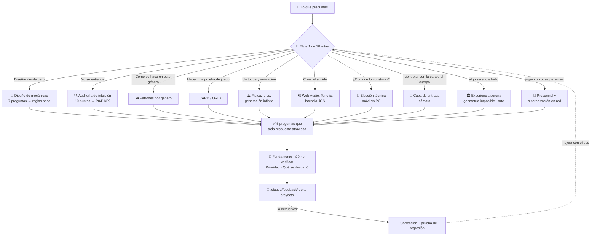

# ⚡ intuitive-game-design

[](https://claude.com/claude-code)
[](.github/workflows/validate-plugin.yml)
[](LICENSE)
[](#-funciona-de-verdad)
[](#-intuitive-game-design)

[English](README.md) · [日本語](README.ja.md) · [简体中文](README.zh-CN.md) · **Español** · [한국어](README.ko.md)

> **Crea un juego que nadie necesita que le expliquen: desde la primera idea hasta el sonido que hace.**
>
> Un plugin de Claude Code (con un solo skill) para diseño de juegos, sensación de juego y audio. El texto del skill está en inglés; los archivos de referencia que lee están por ahora en japonés. El texto original del skill en japonés se conserva en [`i18n/ja/SKILL.md`](i18n/ja/SKILL.md).

---

## 🔰 ¿Qué es esto?

Piensa en una puerta. Una buena puerta te dice si empujar o tirar solo por su forma: una placa plana significa empujar, una manija significa tirar. Cuando una puerta necesita un cartel que diga EMPUJE, esa puerta ya falló.

Con los juegos pasa lo mismo. Este skill convierte «se entiende cuando te lo explico» en «se entiende sin explicar nada», y después te ayuda a pulir cómo se siente al tocarlo y a que suene de verdad.

---

## 📐 Arquitectura


```mermaid
flowchart TD
    U["👤 Lo que preguntas"] --> R{"🧭 Elige 1 de 10 rutas"}

    R -->|"Diseñar desde cero"| A["📐 Diseño de mecánicas<br/>7 preguntas → reglas base"]
    R -->|"No se entiende"| B["🔍 Auditoría de intuición<br/>10 puntos → P0/P1/P2"]
    R -->|"Cómo se hace en este género"| C["🎮 Patrones por género"]
    R -->|"Hacer una prueba de juego"| D["🧪 CARD / ORID"]
    R -->|"Un toque y sensación"| E["🕹️ Física, juice,<br/>generación infinita"]
    R -->|"Crear el sonido"| F["🔊 Web Audio, Tone.js,<br/>latencia, iOS"]
    R -->|"¿Con qué lo construyo?"| G["📱 Elección técnica<br/>móvil vs PC"]
    R -->|"controlar con la cara o el cuerpo"| H["🎥 Capa de entrada<br/>cámara"]
    R -->|"algo sereno y bello"| I["🏛️ Experiencia serena<br/>geometría imposible · arte"]
    R -->|"jugar con otras personas"| J["👥 Presencial y<br/>sincronización en red"]

    A & B & C & D & E & F & G & H & I & J --> Q["✅ 5 preguntas que<br/>toda respuesta atraviesa"]
    Q --> O["📄 Fundamento · Cómo verificar<br/>Prioridad · Qué se descartó"]
    O --> L["📝 .claude/feedback/ de tu proyecto"]
    L -->|"lo devuelves"| FIX["🔁 Corrección + prueba de regresión"]
    FIX -.->|"mejora con el uso"| R
```

---

## ✨ 3 puntos clave

### 🎯 Convierte «intuitivo» en algo que se puede comprobar
Cinco preguntas transforman una palabra vaga en un veredicto: si alguien que juega por primera vez actúa en 30 segundos, dónde se separan la intención y la percepción, si estás pidiendo más de 4 cosas nuevas a la vez, si la profundidad viene del acoplamiento y no de la cantidad, y si están las tres capas de feedback. Cada respuesta incluye fundamento, forma de verificarlo y prioridad P0/P1/P2.

### 🔧 Trae implementaciones que funcionan, no solo consejos
Coyote time y buffer de entrada (la versión que consume los dos temporizadores correctamente), un motor de Web Audio con desbloqueo, límite de voces y planificador anticipado, y un generador de niveles que nunca produce un hueco imposible de pasar. Son justo las partes que todo el mundo reescribe y todo el mundo equivoca en algún detalle.

### 📈 Convierte sus propios fallos en pruebas de regresión
Cada sesión deja siete líneas en `.claude/feedback/intuitive-game-design.md` de tu proyecto. Devuelve ese archivo y un script transforma los fallos confirmados en casos de eval, así lo corregido se queda corregido en lugar de revertirse en silencio.

---

## 🔄 Antes / Después

| | Antes | Después |
|---|---|---|
| «Los jugadores no lo entienden» | Alargar el tutorial | Encontrar dónde está el desajuste real y corregir el diseño |
| «El salto a veces se siente raro» | Ajustar la gravedad a ojo | Coyote time 100–150 ms, buffer 100 ms, código que funciona |
| «Sin sonido solo en iPhone» | Horas buscando, sin ningún error | Orden de diagnóstico: primero el estado `suspended` |
| Propuestas de mejora | 10 ítems, ninguno implementado | P0 señalado, con su forma de verificarlo |
| Puntuación en eval | 66% (sin skill) | 97%: ejecución histórica con un conjunto anterior de 12 casos; [pendiente de volver a medir](#-funciona-de-verdad) |

---

## 🚀 Instalación y uso

**Requisitos previos:** [Claude Code](https://claude.com/claude-code) (o un entorno compatible que cargue skills). Python 3 solo hace falta para los scripts opcionales del repositorio.

### ⭐ Recomendado — marketplace de plugins de Claude Code

Dentro de Claude Code:

```
/plugin marketplace add takaoumehara/intuitive-game-design-skill
/plugin install intuitive-game-design@intuitive-game-design
```

Esto instala solo el skill (`skills/intuitive-game-design/`), no los README, los evals ni los archivos generados.

Los patrones siguientes son para otros entornos.

### 🖥️ Patrón A — Instalación manual (CLI / terminal)

Clona una vez y crea un enlace simbólico a la carpeta del skill para que los cambios se apliquen al instante:

```bash
git clone https://github.com/takaoumehara/intuitive-game-design-skill.git
ln -s "$(pwd)/intuitive-game-design-skill/skills/intuitive-game-design" ~/.claude/skills/intuitive-game-design
```

Si prefieres copiar en lugar de enlazar:

```bash
git clone https://github.com/takaoumehara/intuitive-game-design-skill.git
cp -r intuitive-game-design-skill/skills/intuitive-game-design ~/.claude/skills/intuitive-game-design
```

### 🧩 Patrón B — IDE con IA integrada

Para una instalación manual, Claude Code lee los skills desde dos ubicaciones. Pon el contenido de `skills/intuitive-game-design/` en una de ellas; usa la ruta del proyecto para compartirlo con tu equipo por git:

```bash
# Disponible en todos los proyectos
~/.claude/skills/intuitive-game-design/

# Solo en este proyecto, se sube al repositorio
<your-project>/.claude/skills/intuitive-game-design/
```

Reinicia Claude Code después de instalarlo. El skill se activa solo: basta con contar en qué estás trabajando.

```
El tutorial de mi juego de acción móvil tiene 7 pantallas y ahí se va el 30% de los jugadores
Los testers dicen que el salto «a veces no responde»
En Chrome suena, pero en iPhone no se oye nada
```

### 🌐 Patrón C — claude.ai (web)

Genera el archivo desde el repositorio (empaqueta `skills/intuitive-game-design/` y `LICENSE` en una única carpeta de nivel superior):

```bash
python3 scripts/package.py          # escribe dist/intuitive-game-design.zip (--out <ruta> para escribirlo en otro sitio)
```

> El [`dist/intuitive-game-design.zip`](dist/intuitive-game-design.zip) incluido en el repositorio se generó antes del cambio a la estructura de plugin y todavía contiene el texto del skill solo en japonés. Regenéralo como se indica arriba hasta que se suba una copia nueva.

1. En claude.ai, abre **Settings → Capabilities** y activa **Code execution and file creation** si el menú de Skills aparece deshabilitado (solo hace falta en los planes Free/Pro/Max; en Team y Enterprise ya viene activado).
2. Ve a **Settings → Skills → Create skill**.
3. Sube `dist/intuitive-game-design.zip`.

> claude.ai solo acepta la extensión `.zip`, y el archivo debe contener una única carpeta de nivel superior con `SKILL.md` directamente dentro. `scripts/package.py` lo genera con esa estructura y la comprueba.

### 🛠️ Patrón D — Desde el código fuente

Comprueba que todo funciona antes de instalarlo:

```bash
git clone https://github.com/takaoumehara/intuitive-game-design-skill.git
cd intuitive-game-design-skill

claude plugin validate --strict .                                     # manifiesto del marketplace
claude plugin validate --strict .claude-plugin/plugin.json            # manifiesto del plugin
node --check skills/intuitive-game-design/assets/juice-controller.js  # sintaxis de las implementaciones incluidas
python3 scripts/log_summary.py feedback/log.md                        # las herramientas de feedback se ejecutan
```

### 💎 Patrón E — Google Gem (Gemini)

Un Gem admite pocos archivos de conocimiento, así que **las ~20 referencias no se pueden subir tal cual.** [`dist/gem/`](dist/gem/) contiene el mismo material plegado en unos pocos archivos. El `dist/gem/` incluido en el repositorio es anterior al texto del skill en inglés; regenéralo para obtener la versión actual.

1. Pega `dist/gem/instructions.md` en el campo **Instrucciones** del Gem
2. Sube los **7 archivos** de `dist/gem/split/` como conocimiento

Si el límite es menor, sube el único archivo de `dist/gem/single/` (contenido idéntico). Si el campo de instrucciones se queda corto, usa `instructions-short.md`. Pasos completos: [`gem/SETUP.md`](gem/SETUP.md).

```bash
python3 scripts/build_gem.py   # reconstruir tras editar el skill (--out <dir> para escribirlo en otro sitio)
```

### 🔁 Mejorarlo mientras lo usas

Al terminar, el skill añade siete líneas a `.claude/feedback/intuitive-game-design.md` **de tu proyecto**, no dentro de la carpeta del skill, que se reemplaza cada vez que se actualiza el plugin. El [`feedback/log.md`](feedback/log.md) de este repositorio es el registro seleccionado por el mantenedor. Cuando tengas varias entradas, devuelve tu archivo:

> Lee este registro y mejora el skill

```bash
python3 scripts/log_summary.py path/to/intuitive-game-design.md    # qué se repite, qué volvió a fallar
python3 scripts/log_to_eval.py path/to/intuitive-game-design.md    # fallos → pruebas de regresión
```

La línea que más importa es `Corrected:`: lo que tuviste que decir dos veces, con tus propias palabras. Si lo dijiste una vez y no funcionó, es una instrucción que falta en el skill, y es la única señal que el skill no puede evaluarse a sí mismo. Ver [`feedback/README.md`](feedback/README.md).

---

## 📊 ¿Funciona de verdad?

> **Estado: pendiente de volver a medir.** Las cifras de abajo vienen de una **ejecución histórica con un conjunto anterior de 12 casos / 64 afirmaciones**. El conjunto actual de [`evals/evals.json`](evals/evals.json) tiene **21 casos / 158 afirmaciones** (las rutas G–J se añadieron después) y todavía no se ha vuelto a ejecutar. Las respuestas originales, la salida de la calificación, los nombres de los modelos y la fecha de esa ejecución **no se subieron al repositorio**, así que no se puede reproducir a partir de él: tómalo como un resultado previo sin verificar. Lo que una nueva medición debe subir al repositorio se detalla en [`evals/README.md`](evals/README.md).

Ejecución histórica: doce consultas reales, cada una respondida dos veces: una con el skill y otra con el mismo modelo sin él. La calificación la hizo un tercer modelo independiente contra 64 afirmaciones objetivas.

| Área | Con skill | Sin skill |
|---|---|---|
| Diseño y diagnóstico | 22/23 | 12/23 |
| Juegos de un toque y sensación | 17/18 | 12/18 |
| Implementación de audio | 23/23 | 18/23 |
| **Total** | **62/64 (97%)** | **42/64 (66%)** |
| Variación (desv. típica) | **±7,2 pts** | ±28,0 pts |

La menor variación importa más que el promedio. Algo que solo a veces sale bien no es algo en lo que puedas apoyarte.

**Lo que costó en esa ejecución:** unas 1,9 veces más tokens y alrededor de 80 segundos más por respuesta, porque el skill lee archivos de referencia antes de responder. Esto también hay que volver a medirlo: el texto del skill se ha traducido al inglés desde entonces, y eso cambia su tamaño.

**Lo que detectó la calificación:** el skill entregaba código que importaba archivos que el usuario no tenía, filtraba sus propios números de sección internos al texto visible, y perdió contra el modelo sin skill en un caso. Los tres se corrigieron y se convirtieron en pruebas de regresión que forman parte del conjunto actual. Medir con honestidad saca esto a la luz; una puntuación sola lo esconde.

---

## 📁 Qué contiene

```
.claude-plugin/         plugin.json + marketplace.json (instalación con /plugin)
skills/intuitive-game-design/
  SKILL.md              Enrutador: 10 rutas, 5 preguntas, los límites que no se cruzan (en inglés)
  references/core/      Affordance, MDA, carga cognitiva, ritmo y sinestesia, capa de entrada, cámara, geometría imposible, experiencias serenas, jugar en compañía
  references/simple/    Mecánicas de un toque, juice, construcción de runners, generación procedural, clásicos
  references/audio/     Web Audio, Tone.js, IA generativa, trampas de cada plataforma
  references/web-stack.md    Todas las tecnologías visuales y de audio: móvil vs PC
  references/art-pipeline.md Belleza y ligereza al mismo tiempo
  workflows/            Diseño · Auditoría de intuición · Protocolo de pruebas (procedimientos en markdown)
  assets/               Código ejecutable: sensación, generador de niveles, audio, efectos
i18n/ja/SKILL.md        Texto original del skill en japonés (solo como referencia; Claude no lo carga)
feedback/               El ciclo de mejora (procedimiento + registro seleccionado por el mantenedor)
evals/                  Casos de eval (21 casos / 158 afirmaciones) y requisitos para volver a medir
scripts/                Registro → prueba de regresión · package.py genera el zip de claude.ai, build_gem.py la exportación para Gem
gem/                    Texto de instrucciones para Google Gem (build_gem.py escribe dist/gem/)
dist/                   Zip para claude.ai y exportación para Gem ya generados (ahora desactualizados: regenéralos, ver arriba)
```

Los archivos de `references/` y `workflows/` están por ahora en japonés; Claude los lee y te responde en tu idioma.

---

## 📄 Licencia

[MIT](LICENSE)
