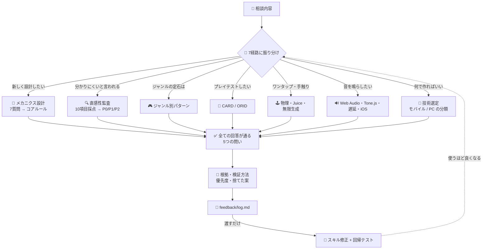

# ⚡ intuitive-game-design

[](https://claude.com/claude-code)
[](LICENSE)
[](#-本当に効果があるのか)
[](#-intuitive-game-design)

[English](README.md) · **日本語** · [简体中文](README.zh-CN.md) · [Español](README.es.md) · [한국어](README.ko.md)

> **説明書を読ませないゲームを、最初のアイデアから鳴らす音まで作る。**

---

## 🔰 これは何？

ドアを思い浮かべてください。良いドアは、形を見ただけで押すか引くかが分かります。平らな板なら押す、取っ手なら引く。「押す」と書いた紙が貼ってある時点で、そのドアは失敗しています。

ゲームも同じです。このスキルは「説明すれば分かる」を「説明しなくても分かる」に変えます。そのうえで、触った時の気持ちよさを詰め、実際に音が鳴るところまで面倒を見ます。

---

## 📐 システム概念図



---

## ✨ 3つの強み

### 🎯 「直感的」を確かめられるものにする
5つの問いが、曖昧な言葉を判定に変えます。初見の人が30秒以内に動けるか、設計者の意図とプレイヤーの知覚がどこでズレているか、一度に4つを超える新しいものを渡していないか、深さが要素の数ではなく結合から生まれているか、フィードバックの3層が揃っているか。回答には必ず根拠・検証方法・P0/P1/P2の優先度が付きます。

### 🔧 助言だけでなく、動く実装が入っている
コヨーテタイムと入力バッファ（両方のタイマーを正しく消費する版）、アンロックと発音数制限と先読みスケジューラを備えたWeb Audioエンジン、詰みを絶対に生成しないレベル生成器。どれも誰もが書き直し、誰もが微妙に間違える部分です。

### 📈 自分の失敗が回帰テストに変わる
作業ごとに `feedback/log.md` へ7行が残ります。そのファイルを渡すと、確認された失敗がスクリプトでevalケースに変換されます。一度直したものが、次の修正で静かに元へ戻ることがなくなります。

---

## 🔄 導入前 / 導入後

| | 導入前 | 導入後 |
|---|---|---|
| 「プレイヤーが理解してくれない」 | チュートリアルを長くする | ズレの正体を特定し、設計側を直す |
| 「ジャンプがたまに変」 | 重力の値を勘で触る | コヨーテタイム100〜150ms、入力バッファ100ms、動くコード |
| 「iPhoneだけ音が出ない」 | エラーが出ないまま何時間も探す | 診断の順序。まず `suspended` を疑う |
| 改善提案 | 10個並べて1個も実装されない | P0を名指し、検証方法まで書く |
| eval実測スコア | 66%（スキルなし） | **97%**（12ケース） |

---

## 🚀 インストールと使い方

**必要なもの:** [Claude Code](https://claude.com/claude-code)（またはスキルを読み込める互換ハーネス）。Python 3 は任意のフィードバック用スクリプト2本にのみ必要です。

### 🖥️ パターンA — CLI / ターミナル

一度クローンし、シンボリックリンクを張ると編集が即反映されます。

```bash
git clone https://github.com/takaoumehara/intuitive-game-design-skill.git
ln -s "$(pwd)/intuitive-game-design-skill" ~/.claude/skills/intuitive-game-design
```

リンクではなくコピーで入れる場合:

```bash
git clone https://github.com/takaoumehara/intuitive-game-design-skill.git
cp -r intuitive-game-design-skill ~/.claude/skills/intuitive-game-design
```

### 🧩 パターンB — AI統合IDE

Claude Code は2箇所からスキルを読みます。プロジェクト側に置くと、git経由でチームに共有できます。

```bash
# 全プロジェクトで使える
~/.claude/skills/intuitive-game-design/

# このプロジェクトだけ。リポジトリにコミットされる
<your-project>/.claude/skills/intuitive-game-design/
```

インストール後に Claude Code を再起動してください。スキルは自動で起動します。作業内容を話しかけるだけです。

```
スマホのアクションゲームのチュートリアルが7画面あって、そこで3割離脱してます
テスターから「たまにジャンプが反応しない」と言われます
Chromeでは鳴るのに、iPhoneだと音が出ません
```

### 🌐 パターンC — claude.ai（Web）

[`dist/intuitive-game-design.zip`](dist/intuitive-game-design.zip) にビルド済みのアーカイブがあります。このリポジトリの管理下ファイルから直接作られているので、常にGitHub上の内容と一致します。

1. claude.aiで **設定 → Capabilities** を開き、Skillsメニューがグレーアウトしている場合は **Code execution and file creation** をオンにします（Free/Pro/Maxプランのみ必要。Team・Enterpriseは既定でオン）。
2. **設定 → Skills → Create skill** を開きます。
3. `dist/intuitive-game-design.zip` をアップロードします。

> claude.ai は拡張子 `.zip` のみを受け付け、アーカイブの中は `SKILL.md` を直接含む1つのフォルダだけである必要があります。`dist/intuitive-game-design.zip` は既にその形で作られています。スキルを編集した後は `python3 scripts/package.py` で作り直せます。

### 🛠️ パターンD — ソースから

インストール前に動作を確認する場合:

```bash
git clone https://github.com/takaoumehara/intuitive-game-design-skill.git
cd intuitive-game-design-skill

node --check assets/juice-controller.js     # 同梱実装の構文チェック
python3 scripts/log_summary.py feedback/log.md   # フィードバック用スクリプトの動作確認
```

### 🔁 使いながら育てる

作業の終わりに、スキルが `feedback/log.md` へ7行を追記します。何件か溜まったら、そのファイルを渡してください。

> このログを見てスキルを改善して

```bash
python3 scripts/log_summary.py feedback/log.md    # 繰り返される指摘、再発した項目
python3 scripts/log_to_eval.py feedback/log.md    # 失敗 → 回帰テスト
```

最も重要な行は `Corrected:` です。あなたが言い直したことを、あなたの言葉のまま書きます。一度言って伝わらなかったなら、それはスキルに書かれていない指示であり、**スキルが自分では採点できない唯一の指標**です。詳細は [`feedback/README.md`](feedback/README.md) にあります。

---

## 📊 本当に効果があるのか

実際にありそうな相談を12件用意し、それぞれ2回ずつ回答させました。1回はスキルあり、もう1回は同じモデルでスキルなし。採点は独立した第3のモデルが、64個の客観的なアサーションに対して行っています。

| 領域 | スキルあり | スキルなし |
|---|---|---|
| 設計・診断 | 22/23 | 12/23 |
| ワンタップゲーム・手触り | 17/18 | 12/18 |
| 音の実装 | 23/23 | 18/23 |
| **合計** | **62/64（97%）** | **42/64（66%）** |
| ばらつき（標準偏差） | **±7.2pt** | ±28.0pt |

平均よりも、ばらつきが小さいことのほうが重要です。たまにしか良い結果が出ないものは、頼りにできません。

**コスト:** トークンで約1.9倍、1回の回答あたり約80秒増えます。回答前に参照ファイルを読むためです。

**採点で見つかった問題:** ユーザーが持っていないファイルを import するコードを出力していた、内部の章番号がユーザー向け本文に漏れていた、1ケースでスキルなしに負けた。3つとも修正済みで、3つとも回帰テストになっています。正直に測ればこれが見つかります。点数だけを見ていると隠れたままです。

---

## 📁 中身

```
SKILL.md              ルーター。7経路、5つの問い、越えてはいけない線
references/core/      アフォーダンス、MDA、認知負荷、リズムと共感覚
references/simple/    ワンタップのメカニクス、Juice、ランナーの組み立て、無限生成、名作カタログ
references/audio/     Web Audio、Tone.js、生成AI、プラットフォームの落とし穴
references/web-stack.md  ビジュアル・音響の全技術。モバイルで動く / PCが要る の分類
workflows/            設計パイプライン・直感性監査・プレイテスト手順
assets/               動く実装。手触り補正、地形生成、音響エンジン、効果音集
feedback/             改善ループ
scripts/              ログ → 回帰テスト。package.py が claude.ai用zipを再生成
dist/                 claude.ai用のビルド済みzip（設定 → Skills）
```

---

## 📄 ライセンス

[MIT](LICENSE)
