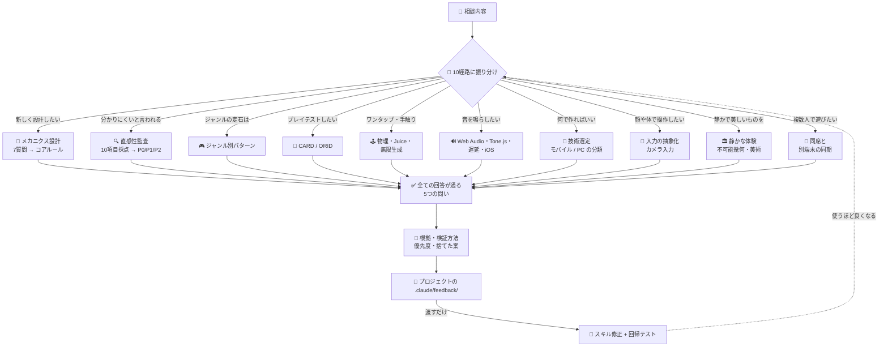

# ⚡ intuitive-game-design

[](https://claude.com/claude-code)
[](.github/workflows/validate-plugin.yml)
[](LICENSE)
[](#-本当に効果があるのか)
[](#-intuitive-game-design)

[English](README.md) · **日本語** · [简体中文](README.zh-CN.md) · [Español](README.es.md) · [한국어](README.ko.md)

> **説明書を読ませないゲームを、最初のアイデアから鳴らす音まで作る。**
>
> ゲームデザイン・手触り・音のための Claude Code プラグイン（スキル1つ）です。スキル本体（SKILL.md）は英語、そこから読むリファレンスは現在日本語です。日本語の原本は [`i18n/ja/SKILL.md`](i18n/ja/SKILL.md) に残しています。

---

## 🔰 これは何？

ドアを思い浮かべてください。良いドアは、形を見ただけで押すか引くかが分かります。平らな板なら押す、取っ手なら引く。「押す」と書いた紙が貼ってある時点で、そのドアは失敗しています。

ゲームも同じです。このスキルは「説明すれば分かる」を「説明しなくても分かる」に変えます。そのうえで、触った時の気持ちよさを詰め、実際に音が鳴るところまで面倒を見ます。

---

## 📐 システム概念図


```mermaid
flowchart TD
    U["👤 相談内容"] --> R{"🧭 10経路に振り分け"}

    R -->|"新しく設計したい"| A["📐 メカニクス設計<br/>7質問 → コアルール"]
    R -->|"分かりにくいと言われる"| B["🔍 直感性監査<br/>10項目採点 → P0/P1/P2"]
    R -->|"ジャンルの定石は"| C["🎮 ジャンル別パターン"]
    R -->|"プレイテストしたい"| D["🧪 CARD / ORID"]
    R -->|"ワンタップ・手触り"| E["🕹️ 物理・Juice・<br/>無限生成"]
    R -->|"音を鳴らしたい"| F["🔊 Web Audio・Tone.js・<br/>遅延・iOS"]
    R -->|"何で作ればいい"| G["📱 技術選定<br/>モバイル / PC の分類"]
    R -->|"顔や体で操作したい"| H["🎥 入力の抽象化<br/>カメラ入力"]
    R -->|"静かで美しいものを"| I["🏛️ 静かな体験<br/>不可能幾何・美術"]
    R -->|"複数人で遊びたい"| J["👥 同席と<br/>別端末の同期"]

    A & B & C & D & E & F & G & H & I & J --> Q["✅ 全ての回答が通る<br/>5つの問い"]
    Q --> O["📄 根拠・検証方法<br/>優先度・捨てた案"]
    O --> L["📝 プロジェクトの .claude/feedback/"]
    L -->|"渡すだけ"| FIX["🔁 スキル修正 + 回帰テスト"]
    FIX -.->|"使うほど良くなる"| R
```

---

## ✨ 3つの強み

### 🎯 「直感的」を確かめられるものにする
5つの問いが、曖昧な言葉を判定に変えます。初見の人が30秒以内に動けるか、設計者の意図とプレイヤーの知覚がどこでズレているか、一度に4つを超える新しいものを渡していないか、深さが要素の数ではなく結合から生まれているか、フィードバックの3層が揃っているか。回答には必ず根拠・検証方法・P0/P1/P2の優先度が付きます。

### 🔧 助言だけでなく、動く実装が入っている
コヨーテタイムと入力バッファ（両方のタイマーを正しく消費する版）、アンロックと発音数制限と先読みスケジューラを備えたWeb Audioエンジン、詰みを絶対に生成しないレベル生成器。どれも誰もが書き直し、誰もが微妙に間違える部分です。

### 📈 自分の失敗が回帰テストに変わる
作業ごとに、プロジェクトの `.claude/feedback/intuitive-game-design.md` へ7行が残ります。そのファイルを渡すと、確認された失敗がスクリプトでevalケースに変換されます。一度直したものが、次の修正で静かに元へ戻ることがなくなります。

---

## 🔄 導入前 / 導入後

| | 導入前 | 導入後 |
|---|---|---|
| 「プレイヤーが理解してくれない」 | チュートリアルを長くする | ズレの正体を特定し、設計側を直す |
| 「ジャンプがたまに変」 | 重力の値を勘で触る | コヨーテタイム100〜150ms、入力バッファ100ms、動くコード |
| 「iPhoneだけ音が出ない」 | エラーが出ないまま何時間も探す | 診断の順序。まず `suspended` を疑う |
| 改善提案 | 10個並べて1個も実装されない | P0を名指し、検証方法まで書く |
| evalスコア | 66%（スキルなし） | 97%（以前の12ケース版での過去の計測。[再計測待ち](#-本当に効果があるのか)） |

---

## 🚀 インストールと使い方

**必要なもの:** [Claude Code](https://claude.com/claude-code)（またはスキルを読み込める互換ハーネス）。Python 3 は任意のリポジトリ用スクリプトにのみ必要です。

### ⭐ おすすめ — Claude Code のプラグインマーケットプレイス

Claude Code の中で:

```
/plugin marketplace add takaoumehara/intuitive-game-design-skill
/plugin install intuitive-game-design@intuitive-game-design
```

入るのはスキル本体（`skills/intuitive-game-design/`）だけで、README・eval・ビルド成果物は入りません。

以下のパターンは、それ以外の環境向けです。

### 🖥️ パターンA — 手動インストール（CLI / ターミナル）

一度クローンし、スキルのフォルダにシンボリックリンクを張ると編集が即反映されます。

```bash
git clone https://github.com/takaoumehara/intuitive-game-design-skill.git
ln -s "$(pwd)/intuitive-game-design-skill/skills/intuitive-game-design" ~/.claude/skills/intuitive-game-design
```

リンクではなくコピーで入れる場合:

```bash
git clone https://github.com/takaoumehara/intuitive-game-design-skill.git
cp -r intuitive-game-design-skill/skills/intuitive-game-design ~/.claude/skills/intuitive-game-design
```

### 🧩 パターンB — AI統合IDE

手動で入れる場合、Claude Code は2箇所からスキルを読みます。`skills/intuitive-game-design/` の中身をどちらかに置いてください。プロジェクト側に置くと、git経由でチームに共有できます。

```bash
# 全プロジェクトで使える
~/.claude/skills/intuitive-game-design/

# このプロジェクトだけ。リポジトリにコミットされる
<your-project>/.claude/skills/intuitive-game-design/
```

インストール後に Claude Code を再起動してください。スキルは自動で起動します。作業内容を話しかけるだけです。

```
スマホのアクションゲームのチュートリアルが7画面あって、そこで3割離脱してます
テスターから「たまにジャンプが反応しない」と言われます
Chromeでは鳴るのに、iPhoneだと音が出ません
```

### 🌐 パターンC — claude.ai（Web）

リポジトリからアーカイブを作ります（`skills/intuitive-game-design/` と `LICENSE` を1つのフォルダに入れます）。

```bash
python3 scripts/package.py          # dist/intuitive-game-design.zip を書き出す（--out <パス> で別の場所へ）
```

> コミット済みの [`dist/intuitive-game-design.zip`](dist/intuitive-game-design.zip) はプラグイン構成に移る前に作ったもので、中身は日本語版のスキルのままです。新しいものがコミットされるまでは、上のコマンドで作り直してください。

1. claude.aiで **設定 → Capabilities** を開き、Skillsメニューがグレーアウトしている場合は **Code execution and file creation** をオンにします（Free/Pro/Maxプランのみ必要。Team・Enterpriseは既定でオン）。
2. **設定 → Skills → Create skill** を開きます。
3. `dist/intuitive-game-design.zip` をアップロードします。

> claude.ai は拡張子 `.zip` のみを受け付け、アーカイブの中は `SKILL.md` を直接含む1つのフォルダだけである必要があります。`scripts/package.py` はその形で作り、検査もします。

### 🛠️ パターンD — ソースから

インストール前に動作を確認する場合:

```bash
git clone https://github.com/takaoumehara/intuitive-game-design-skill.git
cd intuitive-game-design-skill

claude plugin validate --strict .                                     # マーケットプレイスの manifest
claude plugin validate --strict .claude-plugin/plugin.json            # プラグインの manifest
node --check skills/intuitive-game-design/assets/juice-controller.js  # 同梱実装の構文チェック
python3 scripts/log_summary.py feedback/log.md                        # フィードバック用スクリプトの動作確認
```

### 💎 パターンE — Google Gem（Gemini）

Gem はナレッジに添付できる本数が少なく、**20個のリファレンスをそのまま入れられません。** 中身を変えずに数ファイルへ畳んだものが [`dist/gem/`](dist/gem/) にあります。コミット済みの `dist/gem/` は英語版スキルより前のものなので、最新版は下のコマンドで作り直してください。

1. `dist/gem/instructions.md` の中身を、Gem の**手順（Instructions）**欄に貼る
2. `dist/gem/split/` の**7ファイル**をナレッジにアップロードする

本数の上限に引っかかる場合は、代わりに `dist/gem/single/` の1ファイルだけを入れてください（内容は同じです）。手順欄に入りきらない場合は `instructions-short.md` に差し替えます。詳しい手順と動作確認は [`gem/SETUP.md`](gem/SETUP.md)。

```bash
python3 scripts/build_gem.py   # 本体を編集したら作り直す（--out <ディレクトリ> で別の場所へ）
```

### 🔁 使いながら育てる

作業の終わりに、スキルが**あなたのプロジェクトの** `.claude/feedback/intuitive-game-design.md` へ7行を追記します。スキルのフォルダの中には書きません（プラグインの更新で置き換わるため）。このリポジトリの [`feedback/log.md`](feedback/log.md) は、メンテナーが整理して載せるログです。何件か溜まったら、あなたのファイルを渡してください。

> このログを見てスキルを改善して

```bash
python3 scripts/log_summary.py path/to/intuitive-game-design.md    # 繰り返される指摘、再発した項目
python3 scripts/log_to_eval.py path/to/intuitive-game-design.md    # 失敗 → 回帰テスト
```

最も重要な行は `Corrected:` です。あなたが言い直したことを、あなたの言葉のまま書きます。一度言って伝わらなかったなら、それはスキルに書かれていない指示であり、**スキルが自分では採点できない唯一の指標**です。詳細は [`feedback/README.md`](feedback/README.md) にあります。

---

## 📊 本当に効果があるのか

> **状況：再計測待ち。** 下の数字は、**以前の12ケース・64アサーション版で行った過去の計測**です。現在の [`evals/evals.json`](evals/evals.json) は **21ケース・158アサーション**（経路G〜Jを後から追加）で、まだ計測し直していません。過去の計測の生の回答・採点結果・使ったモデル名・実施日は**コミットされておらず**、このリポジトリからは再現できません。検証されていない過去の結果として扱ってください。再計測でコミットすべきものは [`evals/README.md`](evals/README.md) にあります。

過去の計測：実際にありそうな相談を12件用意し、それぞれ2回ずつ回答させました。1回はスキルあり、もう1回は同じモデルでスキルなし。採点は独立した第3のモデルが、64個の客観的なアサーションに対して行っています。

| 領域 | スキルあり | スキルなし |
|---|---|---|
| 設計・診断 | 22/23 | 12/23 |
| ワンタップゲーム・手触り | 17/18 | 12/18 |
| 音の実装 | 23/23 | 18/23 |
| **合計** | **62/64（97%）** | **42/64（66%）** |
| ばらつき（標準偏差） | **±7.2pt** | ±28.0pt |

平均よりも、ばらつきが小さいことのほうが重要です。たまにしか良い結果が出ないものは、頼りにできません。

**その計測でのコスト:** トークンで約1.9倍、1回の回答あたり約80秒増えました。回答前に参照ファイルを読むためです。これも再計測が必要です（その後スキル本体を英語に訳したので、分量が変わっています）。

**採点で見つかった問題:** ユーザーが持っていないファイルを import するコードを出力していた、内部の章番号がユーザー向け本文に漏れていた、1ケースでスキルなしに負けた。3つとも修正済みで、3つとも現在の eval に回帰テストとして入っています。正直に測ればこれが見つかります。点数だけを見ていると隠れたままです。

---

## 📁 中身

```
.claude-plugin/         plugin.json と marketplace.json（/plugin で入れるため）
skills/intuitive-game-design/
  SKILL.md              ルーター。10経路、5つの問い、越えてはいけない線（英語）
  references/core/      アフォーダンス、MDA、認知負荷、リズムと共感覚、入力の抽象化、カメラ入力、不可能幾何、静かな体験、複数人で遊ぶ
  references/simple/    ワンタップのメカニクス、Juice、ランナーの組み立て、無限生成、名作カタログ
  references/audio/     Web Audio、Tone.js、生成AI、プラットフォームの落とし穴
  references/web-stack.md    ビジュアル・音響の全技術。モバイルで動く / PCが要る の分類
  references/art-pipeline.md 美しさと軽さを同時に取る美術パイプライン
  workflows/            設計パイプライン・直感性監査・プレイテスト手順（Markdown の手順書）
  assets/               動く実装。手触り補正、地形生成、音響エンジン、効果音集
i18n/ja/SKILL.md        スキル本体の日本語原本（参照用。Claude は読み込まない）
feedback/               改善ループ（手順書とメンテナーの整理済みログ）
evals/                  eval ケース（21件・158アサーション）と再計測の要件
scripts/                ログ → 回帰テスト。package.py が zip、build_gem.py が Gem用を再生成
gem/                    Google Gem の手順文（build_gem.py が dist/gem/ へ書き出す）
dist/                   claude.ai用のzipと Gem 用の書き出し（現在は古い。上の手順で作り直す）
```

`references/` と `workflows/` の中身は現在日本語です。

---

## 📄 ライセンス

[MIT](LICENSE)
