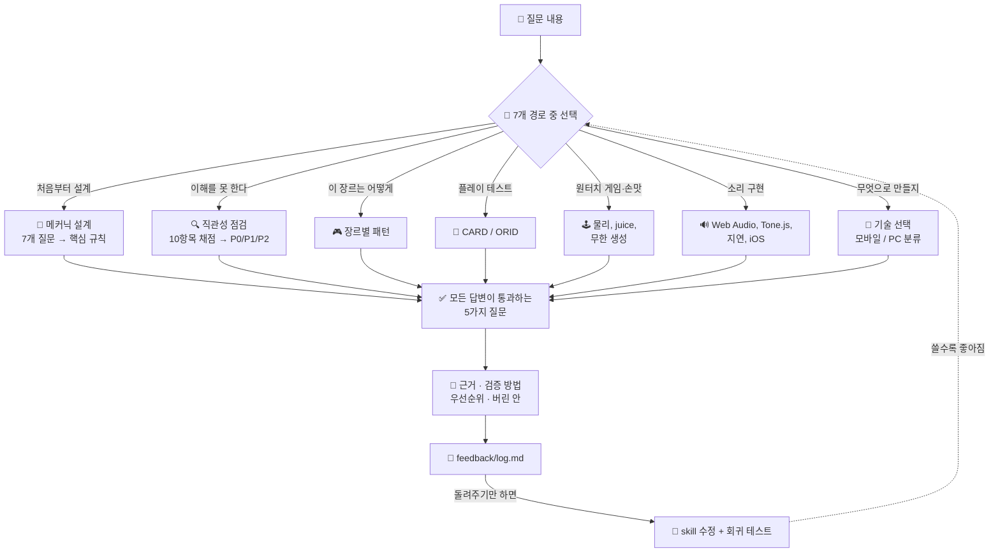

# ⚡ intuitive-game-design

[](https://claude.com/claude-code)
[](LICENSE)
[](#-정말-효과가-있나요)
[](#-intuitive-game-design)

[English](README.md) · [日本語](README.ja.md) · [简体中文](README.zh-CN.md) · [Español](README.es.md) · **한국어**

> **설명서를 읽지 않아도 되는 게임을 만듭니다. 첫 아이디어부터 게임이 내는 소리까지.**

---

## 🔰 이게 뭔가요?

문을 떠올려 보세요. 좋은 문은 생김새만으로 밀지 당길지 알려 줍니다. 평평한 판이면 밀고, 손잡이가 있으면 당깁니다. "미시오"라고 적힌 종이가 붙어 있다면 그 문은 이미 실패한 겁니다.

게임도 똑같습니다. 이 skill은 "설명하면 이해된다"를 "설명하지 않아도 이해된다"로 바꿉니다. 그다음 손맛을 다듬고, 실제로 소리가 나는 데까지 함께 갑니다.

---

## 📐 시스템 구조



---

## ✨ 3가지 강점

### 🎯 "직관적"을 확인 가능한 것으로 바꿉니다
5가지 질문이 모호한 단어를 판정으로 바꿉니다. 처음 하는 사람이 30초 안에 움직일 수 있는지, 설계 의도와 플레이어의 인식이 어디서 어긋나는지, 한 번에 4개가 넘는 새로운 것을 요구하지 않는지, 깊이가 개수가 아니라 결합에서 나오는지, 피드백 세 계층이 모두 있는지. 모든 답변에 근거와 검증 방법, P0/P1/P2 우선순위가 함께 붙습니다.

### 🔧 조언만이 아니라 동작하는 구현이 들어 있습니다
코요테 타임과 입력 버퍼(두 타이머를 올바르게 소비하는 버전), 잠금 해제와 동시 발음 수 제한과 선행 스케줄러를 갖춘 Web Audio 엔진, 절대 통과 불가능한 지형을 만들지 않는 레벨 생성기. 모두가 다시 짜고 모두가 미묘하게 틀리는 부분입니다.

### 📈 자신의 실패를 회귀 테스트로 바꿉니다
작업할 때마다 `feedback/log.md`에 7줄이 남습니다. 그 파일을 돌려주면 스크립트가 확인된 실패를 eval 케이스로 변환합니다. 한 번 고친 것이 다음 수정에서 조용히 되돌아가는 일이 없어집니다.

---

## 🔄 도입 전 / 도입 후

| | 도입 전 | 도입 후 |
|---|---|---|
| "플레이어가 이해를 못 한다" | 튜토리얼을 더 길게 쓴다 | 어긋난 지점을 찾아 설계 자체를 고친다 |
| "점프 손맛이 가끔 이상하다" | 중력 값을 감으로 조정 | 코요테 타임 100~150 ms, 입력 버퍼 100 ms, 동작하는 코드 |
| "iPhone에서만 소리가 안 난다" | 오류도 없이 몇 시간 헤맴 | 진단 순서. `suspended` 상태부터 확인 |
| 개선 제안 | 10개를 나열하고 하나도 반영 안 됨 | P0를 지목하고 검증 방법까지 제시 |
| eval 실측 점수 | 66%(skill 없음) | **97%**(12개 케이스) |

---

## 🚀 설치 및 사용법

**필요한 것:** [Claude Code](https://claude.com/claude-code)(또는 skill을 읽을 수 있는 호환 환경). Python 3은 선택 사항인 피드백 스크립트 2개에만 필요합니다.

### 🖥️ 패턴 A — CLI / 터미널

한 번 클론한 뒤 심볼릭 링크로 설치하면 수정이 바로 반영됩니다.

```bash
git clone https://github.com/takaoumehara/intuitive-game-design-skill.git
ln -s "$(pwd)/intuitive-game-design-skill" ~/.claude/skills/intuitive-game-design
```

링크 대신 복사해서 설치하려면:

```bash
git clone https://github.com/takaoumehara/intuitive-game-design-skill.git
cp -r intuitive-game-design-skill ~/.claude/skills/intuitive-game-design
```

### 🧩 패턴 B — AI 통합 IDE

Claude Code는 두 위치에서 skill을 읽습니다. 프로젝트 경로에 두면 git으로 팀에 공유할 수 있습니다.

```bash
# 모든 프로젝트에서 사용
~/.claude/skills/intuitive-game-design/

# 이 프로젝트에서만 사용, 저장소에 커밋됨
<your-project>/.claude/skills/intuitive-game-design/
```

설치한 뒤 Claude Code를 다시 시작하세요. skill은 스스로 켜집니다. 지금 하는 작업을 말하기만 하면 됩니다.

```
모바일 액션 게임 튜토리얼이 7화면인데 거기서 30%가 이탈합니다
테스터들이 점프가 "가끔 반응하지 않는다"고 합니다
Chrome에서는 소리가 나는데 iPhone에서는 아무 소리도 안 납니다
```

### 🌐 패턴 C — claude.ai(웹)

이 저장소가 추적하는 파일로 직접 만든 압축 파일이 [`dist/intuitive-game-design.zip`](dist/intuitive-game-design.zip)에 이미 준비되어 있습니다. 항상 GitHub의 내용과 일치합니다.

1. claude.ai에서 **설정 → Capabilities**를 열고, Skills 메뉴가 비활성화되어 있으면 **Code execution and file creation**을 켭니다(Free/Pro/Max 플랜만 해당. Team·Enterprise는 기본으로 켜져 있습니다).
2. **설정 → Skills → Create skill**로 이동합니다.
3. `dist/intuitive-game-design.zip`을 업로드합니다.

> claude.ai는 `.zip` 확장자만 허용하며, 압축 파일 안에는 `SKILL.md`가 바로 들어 있는 최상위 폴더 하나만 있어야 합니다. `dist/intuitive-game-design.zip`은 이미 이 구조로 만들어져 있습니다. skill을 수정한 뒤에는 `python3 scripts/package.py`로 다시 만들 수 있습니다.

### 🛠️ 패턴 D — 소스에서

설치 전에 동작을 확인하려면:

```bash
git clone https://github.com/takaoumehara/intuitive-game-design-skill.git
cd intuitive-game-design-skill

node --check assets/juice-controller.js     # 내장 구현의 문법 확인
python3 scripts/log_summary.py feedback/log.md   # 피드백 도구 동작 확인
```

### 💎 패턴 E — Google Gem (Gemini)

Gem은 지식 파일을 몇 개밖에 첨부할 수 없어 **참고 문서 20여 개를 그대로 올릴 수 없습니다.** [`dist/gem/`](dist/gem/)에 같은 내용을 몇 개 파일로 접어 둔 것이 있습니다.

1. `dist/gem/instructions.md`의 내용을 Gem의 **지침(Instructions)** 칸에 붙여넣기
2. `dist/gem/split/`의 **7개 파일**을 지식으로 업로드

개수 제한에 걸리면 `dist/gem/single/`의 파일 하나만 올리세요(내용 동일). 지침 칸이 부족하면 `instructions-short.md`로 교체합니다. 자세한 절차: [`gem/SETUP.md`](gem/SETUP.md).

```bash
python3 scripts/build_gem.py   # skill을 수정하면 다시 생성
```

### 🔁 쓰면서 개선하기

작업이 끝나면 skill이 `feedback/log.md`에 7줄을 덧붙입니다. 몇 건 쌓이면 그 파일을 돌려주세요.

> 이 로그를 보고 skill을 개선해 줘

```bash
python3 scripts/log_summary.py feedback/log.md    # 반복되는 지적, 재발한 항목
python3 scripts/log_to_eval.py feedback/log.md    # 실패 → 회귀 테스트
```

가장 중요한 줄은 `Corrected:`입니다. 두 번 말해야 했던 것을 본인의 말 그대로 적습니다. 한 번 말해서 전달되지 않았다면 그건 skill에 빠져 있는 지시이며, skill이 스스로 채점할 수 없는 유일한 지표입니다. 자세한 내용은 [`feedback/README.md`](feedback/README.md)에 있습니다.

---

## 📊 정말 효과가 있나요

실제로 있을 법한 질문 12개를 준비해 각각 두 번씩 답하게 했습니다. 한 번은 skill과 함께, 한 번은 같은 모델에 skill 없이. 채점은 독립적인 세 번째 모델이 64개의 객관적 항목으로 진행했습니다.

| 영역 | skill 사용 | skill 없음 |
|---|---|---|
| 설계와 진단 | 22/23 | 12/23 |
| 원터치 게임과 손맛 | 17/18 | 12/18 |
| 사운드 구현 | 23/23 | 18/23 |
| **합계** | **62/64(97%)** | **42/64(66%)** |
| 편차(표준편차) | **±7.2점** | ±28.0점 |

평균보다 편차가 작다는 점이 더 중요합니다. 가끔만 잘 나오는 것은 기댈 수 없습니다.

**비용:** 토큰이 약 1.9배, 답변 한 번당 약 80초가 더 걸립니다. 답하기 전에 참조 파일을 읽기 때문입니다.

**채점에서 드러난 문제:** 사용자가 갖고 있지 않은 파일을 import하는 코드를 내놓았고, 내부 섹션 번호가 사용자용 본문에 새어 나왔으며, 한 케이스에서는 skill 없는 모델에게 졌습니다. 셋 다 수정했고 셋 다 회귀 테스트가 되었습니다. 정직하게 측정해야 이런 것이 보입니다. 점수만 보면 계속 숨어 있습니다.

---

## 📁 구성

```
SKILL.md              라우터. 9개 경로, 5가지 질문, 넘지 말아야 할 선
references/core/      어포던스, MDA, 인지 부하, 리듬과 공감각, 입력 추상화, 카메라 입력, 불가능 기하, 고요한 경험
references/simple/    원터치 메커닉, juice, 러너 조립, 절차적 생성, 명작 목록
references/audio/     Web Audio, Tone.js, 생성형 AI, 플랫폼 함정
references/web-stack.md    비주얼·오디오 전체 기술을 모바일 / PC로 분류
references/art-pipeline.md 아름다움과 가벼움을 동시에
workflows/            설계 파이프라인 · 직관성 점검 · 플레이 테스트
assets/               동작하는 구현: 손맛 보정, 지형 생성, 오디오 엔진, 효과음
feedback/             개선 루프
scripts/              로그 → 회귀 테스트 · package.py로 claude.ai용 zip 재생성
dist/                 claude.ai용 빌드된 zip(설정 → Skills)
```

---

## 📄 라이선스

[MIT](LICENSE)
