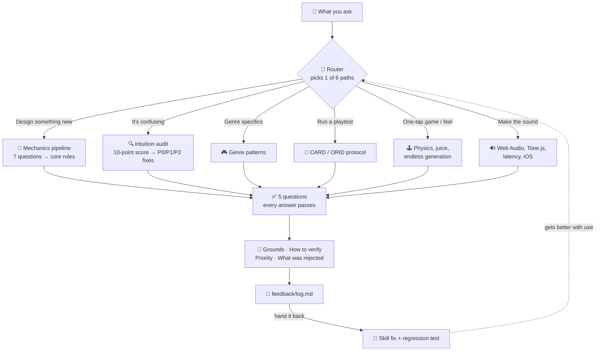

# ⚡ intuitive-game-design

[](https://claude.com/claude-code)
[](#-does-it-actually-work)
[](#-intuitive-game-design)

**English** · [日本語](README.ja.md) · [简体中文](README.zh-CN.md) · [Español](README.es.md) · [한국어](README.ko.md)

> **Build a game nobody has to read instructions for — from the first idea to the sound it makes.**

---

## 🔰 What is this?

Think of a door. A good door tells you whether to push or pull just by its shape — a flat plate means push, a handle means pull. When a door needs a sign that says PUSH, the door has already failed.

Games work the same way. This skill turns "you'll understand once I explain it" into "you understand without being told" — then helps you make it feel good to touch and actually sound like something.

---

## 📐 Architecture



---

## ✨ Features

### 🎯 Makes "intuitive" something you can actually check
Five questions turn a vague word into a verdict: can a first-timer act within 30 seconds, where do intent and perception diverge, are you asking for more than 4 new things at once, is depth coming from coupling instead of count, and are all three feedback layers present. Every answer ships with grounds, a way to verify it, and a P0/P1/P2 priority.

### 🔧 Ships working implementations, not just advice
Coyote time and input buffering that consume both timers correctly, a Web Audio engine with unlock, voice limits and a look-ahead scheduler, and a level generator that provably never produces an unclearable gap. These are the parts everyone rewrites and everyone gets subtly wrong.

### 📈 Turns its own failures into regression tests
Each session leaves seven lines in `feedback/log.md`. Hand that file back and a script converts confirmed failures into eval cases — so a fix stays fixed instead of quietly reverting on the next edit.

---

## 🔄 Before / After

| | Before | After |
|---|---|---|
| "Players don't understand it" | Write a longer tutorial | Find the actual gap, fix the design instead |
| "Jump feels off sometimes" | Guess at gravity values | Coyote time 100–150 ms, input buffer 100 ms, working code |
| "No sound on iPhone only" | Search for hours, no error message | Diagnostic order, `suspended` state checked first |
| Improvement suggestions | 10 items, none implemented | P0 named, verification stated |
| Measured eval score | 66% (no skill) | **97%** across 12 cases |

---

## 🚀 Install & Usage

**Requirements:** [Claude Code](https://claude.com/claude-code) (or a compatible agent harness that loads skills). Python 3 is only needed for the two optional feedback scripts.

### 🖥️ Pattern A — CLI / terminal

Clone once, then symlink so edits take effect immediately:

```bash
git clone https://github.com/takaoumehara/intuitive-game-design-skill.git
ln -s "$(pwd)/intuitive-game-design-skill" ~/.claude/skills/intuitive-game-design
```

To install a copy instead of a link:

```bash
git clone https://github.com/takaoumehara/intuitive-game-design-skill.git
cp -r intuitive-game-design-skill ~/.claude/skills/intuitive-game-design
```

### 🧩 Pattern B — AI-integrated IDE

Claude Code reads skills from two places. Use the project path to share the skill with your team through git:

```bash
# Available in every project
~/.claude/skills/intuitive-game-design/

# Available in this project only, committed to your repo
<your-project>/.claude/skills/intuitive-game-design/
```

Restart Claude Code after installing. The skill triggers on its own — say what you are working on and it activates:

```
The tutorial in my mobile action game is 7 screens long and 30% of players drop off there.
Players tell me the jump "sometimes doesn't respond."
Sound works in Chrome but there's nothing on iPhone.
```

### 🛠️ Pattern D — From source

Verify everything runs before installing:

```bash
git clone https://github.com/takaoumehara/intuitive-game-design-skill.git
cd intuitive-game-design-skill

node --check assets/juice-controller.js     # bundled implementations parse
python3 scripts/log_summary.py feedback/log.md   # feedback tooling runs
```

### 🔁 Improving it as you use it

At the end of a session the skill appends seven lines to `feedback/log.md`. When you have a few entries, hand the file back:

> Read this log and improve the skill.

```bash
python3 scripts/log_summary.py feedback/log.md    # what repeats, what regressed
python3 scripts/log_to_eval.py feedback/log.md    # failures → regression tests
```

The line that matters most is `Corrected:` — what you had to say twice, in your own words. If you said something once and it did not land, that is an instruction missing from the skill, and it is the only signal the skill cannot grade itself on. See [`feedback/README.md`](feedback/README.md).

---

## 📊 Does it actually work?

Twelve real-world prompts, each answered twice — once with the skill, once with the same model and no skill — then graded by an independent third model against 64 objective assertions.

| Area | With skill | No skill |
|---|---|---|
| Design & diagnosis | 22/23 | 12/23 |
| One-tap games & feel | 17/18 | 12/18 |
| Audio implementation | 23/23 | 18/23 |
| **Total** | **62/64 (97%)** | **42/64 (66%)** |
| Variance (std. dev.) | **±7.2 pt** | ±28.0 pt |

The lower variance matters more than the average. A skill that scores well only sometimes is not something you can rely on.

**What it costs:** roughly 1.9× the tokens and about 80 seconds more per answer, because the skill reads reference files before answering.

**What the grader caught:** the skill shipped code importing files the user did not have, leaked its own internal section numbers into user-facing text, and lost to the plain model on one case. All three are fixed, and all three are now regression tests. Honest measurement finds this; a score alone hides it.

---

## 📁 What's inside

```
SKILL.md              Router — 6 paths, 5 questions, the lines not to cross
references/core/      Affordance, MDA, cognitive load, rhythm & synesthesia
references/simple/    One-tap mechanics, juice, procedural generation, a canon of hits
references/audio/     Web Audio, Tone.js, generative AI, platform pitfalls
workflows/            Design pipeline · Intuition audit · Playtest protocol
assets/               Runnable: juice controller, chunk generator, audio engine, SFX library
feedback/             The improvement loop
scripts/              Log → regression test
```

---

## 📄 License

No license file yet — all rights reserved by default until one is added. If you want this to be reusable by others, add a `LICENSE` file.
