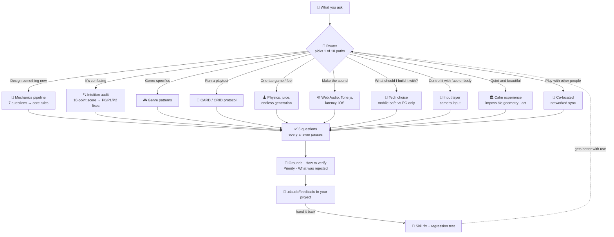

# ⚡ intuitive-game-design

[](https://claude.com/claude-code)
[](.github/workflows/validate-plugin.yml)
[](LICENSE)
[](#-does-it-actually-work)
[](#-intuitive-game-design)

**English** · [日本語](README.ja.md) · [简体中文](README.zh-CN.md) · [Español](README.es.md) · [한국어](README.ko.md)

> **Build a game nobody has to read instructions for — from the first idea to the sound it makes.**
>
> A Claude Code plugin (one skill) for game design, game feel and game audio. The skill body is in English; the reference files it reads are currently in Japanese. The original Japanese skill text is kept at [`i18n/ja/SKILL.md`](i18n/ja/SKILL.md).

---

## 🔰 What is this?

Think of a door. A good door tells you whether to push or pull just by its shape — a flat plate means push, a handle means pull. When a door needs a sign that says PUSH, the door has already failed.

Games work the same way. This skill turns "you'll understand once I explain it" into "you understand without being told" — then helps you make it feel good to touch and actually sound like something.

---

## 📐 Architecture


```mermaid
flowchart TD
    U["👤 What you ask"] --> R{"🧭 Router<br/>picks 1 of 10 paths"}

    R -->|"Design something new"| A["📐 Mechanics pipeline<br/>7 questions → core rules"]
    R -->|"It's confusing"| B["🔍 Intuition audit<br/>10-point score → P0/P1/P2 fixes"]
    R -->|"Genre specifics"| C["🎮 Genre patterns"]
    R -->|"Run a playtest"| D["🧪 CARD / ORID protocol"]
    R -->|"One-tap game / feel"| E["🕹️ Physics, juice,<br/>endless generation"]
    R -->|"Make the sound"| F["🔊 Web Audio, Tone.js,<br/>latency, iOS"]
    R -->|"What should I build it with?"| G["📱 Tech choice<br/>mobile-safe vs PC-only"]
    R -->|"Control it with face or body"| H["🎥 Input layer<br/>camera input"]
    R -->|"Quiet and beautiful"| I["🏛️ Calm experience<br/>impossible geometry · art"]
    R -->|"Play with other people"| J["👥 Co-located<br/>networked sync"]

    A & B & C & D & E & F & G & H & I & J --> Q["✅ 5 questions<br/>every answer passes"]
    Q --> O["📄 Grounds · How to verify<br/>Priority · What was rejected"]
    O --> L["📝 .claude/feedback/ in your project"]
    L -->|"hand it back"| FIX["🔁 Skill fix + regression test"]
    FIX -.->|"gets better with use"| R
```

---

## ✨ Features

### 🎯 Makes "intuitive" something you can actually check
Five questions turn a vague word into a verdict: can a first-timer act within 30 seconds, where do intent and perception diverge, are you asking for more than 4 new things at once, is depth coming from coupling instead of count, and are all three feedback layers present. Every answer ships with grounds, a way to verify it, and a P0/P1/P2 priority.

### 🔧 Ships working implementations, not just advice
Coyote time and input buffering that consume both timers correctly, a Web Audio engine with unlock, voice limits and a look-ahead scheduler, and a level generator that provably never produces an unclearable gap. These are the parts everyone rewrites and everyone gets subtly wrong.

### 📈 Turns its own failures into regression tests
Each session leaves seven lines in your project's `.claude/feedback/intuitive-game-design.md`. Hand that file back and a script converts confirmed failures into eval cases — so a fix stays fixed instead of quietly reverting on the next edit.

---

## 🔄 Before / After

| | Before | After |
|---|---|---|
| "Players don't understand it" | Write a longer tutorial | Find the actual gap, fix the design instead |
| "Jump feels off sometimes" | Guess at gravity values | Coyote time 100–150 ms, input buffer 100 ms, working code |
| "No sound on iPhone only" | Search for hours, no error message | Diagnostic order, `suspended` state checked first |
| Improvement suggestions | 10 items, none implemented | P0 named, verification stated |
| Eval score | 66% (no skill) | 97% — historical run on an earlier 12-case set; [re-measurement pending](#-does-it-actually-work) |

---

## 🚀 Install & Usage

**Requirements:** [Claude Code](https://claude.com/claude-code) (or a compatible agent harness that loads skills). Python 3 is only needed for the optional repo scripts.

### ⭐ Recommended — Claude Code plugin marketplace

Inside Claude Code:

```
/plugin marketplace add takaoumehara/intuitive-game-design-skill
/plugin install intuitive-game-design@intuitive-game-design
```

This installs only the skill (`skills/intuitive-game-design/`) — not the READMEs, evals or build output.

The patterns below are for other setups.

### 🖥️ Pattern A — Manual install (CLI / terminal)

Clone once, then symlink the skill folder so edits take effect immediately:

```bash
git clone https://github.com/takaoumehara/intuitive-game-design-skill.git
ln -s "$(pwd)/intuitive-game-design-skill/skills/intuitive-game-design" ~/.claude/skills/intuitive-game-design
```

To install a copy instead of a link:

```bash
git clone https://github.com/takaoumehara/intuitive-game-design-skill.git
cp -r intuitive-game-design-skill/skills/intuitive-game-design ~/.claude/skills/intuitive-game-design
```

### 🧩 Pattern B — AI-integrated IDE

For a manual install, Claude Code reads skills from two places. Put the contents of `skills/intuitive-game-design/` in one of them; use the project path to share the skill with your team through git:

```bash
# Available in every project
~/.claude/skills/intuitive-game-design/

# Available in this project only, committed to your repo
<your-project>/.claude/skills/intuitive-game-design/
```

Restart Claude Code after installing. The skill triggers on its own — say what you are working on and it activates:

```
The tutorial in my mobile action game is 7 screens long and 30% of players drop off there.
Players tell me the jump "sometimes doesn't respond."
Sound works in Chrome but there's nothing on iPhone.
```

### 🌐 Pattern C — claude.ai (web)

Build the archive from the repo (it packs `skills/intuitive-game-design/` plus `LICENSE` into a single top-level folder):

```bash
python3 scripts/package.py          # writes dist/intuitive-game-design.zip (--out <path> to write elsewhere)
```

> The committed [`dist/intuitive-game-design.zip`](dist/intuitive-game-design.zip) was built before the move to the plugin layout and still contains the Japanese-only skill text. Rebuild it as above until a fresh copy is committed.

1. In claude.ai, open **Settings → Capabilities** and turn on **Code execution and file creation** if the Skills menu is greyed out (Free/Pro/Max plans only; Team and Enterprise have it on by default).
2. Go to **Settings → Skills → Create skill**.
3. Upload `dist/intuitive-game-design.zip`.

> claude.ai only accepts a `.zip` extension, and the archive must contain a single top-level folder holding `SKILL.md` directly — `scripts/package.py` builds it that way and checks it.

### 🛠️ Pattern D — From source

Verify everything runs before installing:

```bash
git clone https://github.com/takaoumehara/intuitive-game-design-skill.git
cd intuitive-game-design-skill

claude plugin validate --strict .                                     # marketplace manifest
claude plugin validate --strict .claude-plugin/plugin.json            # plugin manifest
node --check skills/intuitive-game-design/assets/juice-controller.js  # bundled implementations parse
python3 scripts/log_summary.py feedback/log.md                        # feedback tooling runs
```

### 💎 Pattern E — Google Gem (Gemini)

A Gem accepts only a handful of knowledge files, so **the ~20 references cannot be uploaded as they are.** [`dist/gem/`](dist/gem/) holds the same content folded into a few files. The committed `dist/gem/` predates the English skill text; rebuild it to get the current version.

1. Paste `dist/gem/instructions.md` into the Gem's **Instructions** box
2. Upload the **7 files** in `dist/gem/split/` as knowledge

If the file limit is lower, upload the single file in `dist/gem/single/` instead — identical content. If the instructions box is too small, use `instructions-short.md`. Full steps and a smoke test: [`gem/SETUP.md`](gem/SETUP.md).

```bash
python3 scripts/build_gem.py   # rebuild after editing the skill (--out <dir> to write elsewhere)
```

### 🔁 Improving it as you use it

At the end of a session the skill appends seven lines to `.claude/feedback/intuitive-game-design.md` **in your project** — not inside the skill folder, which is replaced whenever the plugin updates. This repo's [`feedback/log.md`](feedback/log.md) is the maintainer's curated log. When you have a few entries, hand your file back:

> Read this log and improve the skill.

```bash
python3 scripts/log_summary.py path/to/intuitive-game-design.md    # what repeats, what regressed
python3 scripts/log_to_eval.py path/to/intuitive-game-design.md    # failures → regression tests
```

The line that matters most is `Corrected:` — what you had to say twice, in your own words. If you said something once and it did not land, that is an instruction missing from the skill, and it is the only signal the skill cannot grade itself on. See [`feedback/README.md`](feedback/README.md).

---

## 📊 Does it actually work?

> **Status: re-measurement pending.** The numbers below come from a **historical run on an earlier 12-case / 64-assertion set**. The current suite in [`evals/evals.json`](evals/evals.json) has **21 cases / 158 assertions** (routes G–J were added later) and has not been re-run. The raw answers, grading output, model names and run date of the historical run were **not committed**, so it cannot be reproduced from this repo — treat it as an unverified prior result. What a re-measurement must commit is listed in [`evals/README.md`](evals/README.md).

Historical run: twelve real-world prompts, each answered twice — once with the skill, once with the same model and no skill — then graded by an independent third model against 64 objective assertions.

| Area | With skill | No skill |
|---|---|---|
| Design & diagnosis | 22/23 | 12/23 |
| One-tap games & feel | 17/18 | 12/18 |
| Audio implementation | 23/23 | 18/23 |
| **Total** | **62/64 (97%)** | **42/64 (66%)** |
| Variance (std. dev.) | **±7.2 pt** | ±28.0 pt |

The lower variance matters more than the average. A skill that scores well only sometimes is not something you can rely on.

**What it cost in that run:** roughly 1.9× the tokens and about 80 seconds more per answer, because the skill reads reference files before answering. This is also to be re-measured: the skill body has since been translated to English, which changes its size.

**What the grader caught:** the skill shipped code importing files the user did not have, leaked its own internal section numbers into user-facing text, and lost to the plain model on one case. All three were fixed and turned into regression tests that are part of the current suite. Honest measurement finds this; a score alone hides it.

---

## 📁 What's inside

```
.claude-plugin/         plugin.json + marketplace.json (install via /plugin)
skills/intuitive-game-design/
  SKILL.md              Router — 10 paths, 5 questions, the lines not to cross (English)
  references/core/      Affordance, MDA, cognitive load, rhythm & synesthesia, input layer, camera input, impossible geometry, calm experiences, playing together
  references/simple/    One-tap mechanics, juice, the runner build, procedural generation, a canon of hits
  references/audio/     Web Audio, Tone.js, generative AI, platform pitfalls
  references/web-stack.md    Every web visual + audio tech, split by mobile-safe vs PC-only
  references/art-pipeline.md Beauty and lightness at the same time
  workflows/            Design pipeline · Intuition audit · Playtest protocol (markdown procedures)
  assets/               Runnable: juice controller, chunk generator, audio engine, SFX library
i18n/ja/SKILL.md        Original Japanese skill text (reference only; not loaded by Claude)
feedback/               The improvement loop (procedure + maintainer's curated log)
evals/                  Eval cases (21 cases / 158 assertions) and re-measurement requirements
scripts/                Log → regression test · package.py builds the claude.ai zip, build_gem.py the Gem export
gem/                    Instruction text for the Google Gem (build_gem.py writes dist/gem/)
dist/                   Pre-built claude.ai zip and Gem export (currently stale — rebuild, see above)
```

Files under `references/` and `workflows/` are written in Japanese for now; Claude reads them and answers in your language.

---

## 📄 License

[MIT](LICENSE)
