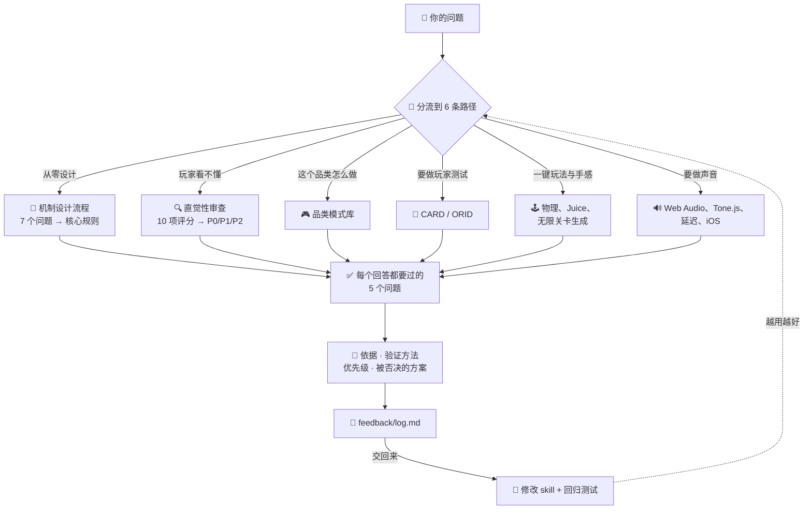

# ⚡ intuitive-game-design

[](https://claude.com/claude-code)
[](LICENSE)
[](#-真的有效吗)
[](#-intuitive-game-design)

[English](README.md) · [日本語](README.ja.md) · **简体中文** · [Español](README.es.md) · [한국어](README.ko.md)

> **做一款不用看说明书的游戏 —— 从最初的构思，到它发出的声音。**

---

## 🔰 这是什么？

想想一扇门。好的门只靠形状就能告诉你是推还是拉：平板是推，把手是拉。当一扇门需要贴上"推"字，这扇门已经失败了。

游戏也一样。这个 skill 把"我解释一下你就懂了"变成"不用解释就懂"，然后帮你把手感打磨到位，把声音真正做出来。

---

## 📐 系统架构



---

## ✨ 三大亮点

### 🎯 把"直觉"变成可以核对的东西
5 个问题把一个模糊的词变成明确判断：新玩家能不能在 30 秒内动起来、设计意图和玩家感知在哪里错位、有没有一次塞过 4 个新概念、深度来自元素数量还是来自耦合、三层反馈是否齐全。每个回答都附带依据、验证方法和 P0/P1/P2 优先级。

### 🔧 不只给建议，直接给可运行的实现
Coyote time 和输入缓冲（正确消耗两个计时器的版本）、带解锁与发声数上限和预调度器的 Web Audio 引擎、绝不会生成死局的关卡生成器。这些都是人人重写、人人写错细节的地方。

### 📈 把自己的失败变成回归测试
每次使用会在 `feedback/log.md` 留下 7 行。把这个文件交回来，脚本会把确认的失败转成 eval 用例 —— 修好的问题不会在下次改动中悄悄退回去。

---

## 🔄 使用前 / 使用后

| | 使用前 | 使用后 |
|---|---|---|
| "玩家看不懂" | 把新手引导写得更长 | 找到错位的真正位置，改设计本身 |
| "跳跃手感偶尔不对" | 凭感觉调重力参数 | Coyote time 100–150 ms、输入缓冲 100 ms、可运行代码 |
| "只有 iPhone 没声音" | 没有报错，查几个小时 | 固定的排查顺序，先看 `suspended` 状态 |
| 改进建议 | 列 10 条，一条也没落地 | 点名 P0，写清验证方法 |
| eval 实测分数 | 66%（不用 skill） | **97%**（12 个用例） |

---

## 🚀 安装与使用

**环境要求：** [Claude Code](https://claude.com/claude-code)（或其他能加载 skill 的兼容环境）。只有两个可选的反馈脚本需要 Python 3。

### 🖥️ 方式 A —— CLI / 终端

克隆一次，用软链接安装，改动立即生效：

```bash
git clone https://github.com/takaoumehara/intuitive-game-design-skill.git
ln -s "$(pwd)/intuitive-game-design-skill" ~/.claude/skills/intuitive-game-design
```

如果想直接复制而不是链接：

```bash
git clone https://github.com/takaoumehara/intuitive-game-design-skill.git
cp -r intuitive-game-design-skill ~/.claude/skills/intuitive-game-design
```

### 🧩 方式 B —— AI 集成 IDE

Claude Code 会从两个位置读取 skill。放在项目目录下，可以通过 git 分享给团队：

```bash
# 所有项目都能用
~/.claude/skills/intuitive-game-design/

# 只在当前项目生效，会提交进仓库
<your-project>/.claude/skills/intuitive-game-design/
```

安装后重启 Claude Code。skill 会自动触发，直接说你在做什么就行：

```
我做的手机动作游戏新手引导有 7 屏，30% 的玩家在那里流失
测试的人说跳跃"偶尔没反应"
Chrome 里有声音，iPhone 上一点声音都没有
```

### 🛠️ 方式 D —— 从源码

安装前先确认能跑起来：

```bash
git clone https://github.com/takaoumehara/intuitive-game-design-skill.git
cd intuitive-game-design-skill

node --check assets/juice-controller.js     # 检查内置实现的语法
python3 scripts/log_summary.py feedback/log.md   # 确认反馈脚本可运行
```

### 🔁 边用边改进

每次用完，skill 会往 `feedback/log.md` 追加 7 行。攒几条之后，把文件交回来：

> 看这份日志，改进这个 skill

```bash
python3 scripts/log_summary.py feedback/log.md    # 重复出现的问题、复发的问题
python3 scripts/log_to_eval.py feedback/log.md    # 失败 → 回归测试
```

最关键的一行是 `Corrected:` —— 你重复说过的话，用你自己的原话记录。如果你说了一遍没被理解，那就是 skill 里缺了一条指令，而这是 skill 唯一无法给自己打分的指标。详见 [`feedback/README.md`](feedback/README.md)。

---

## 📊 真的有效吗

准备了 12 个真实场景的提问，每个回答两次：一次带 skill，一次用同样的模型但不带 skill。评分由独立的第三个模型完成，对照 64 条客观断言。

| 领域 | 带 skill | 不带 skill |
|---|---|---|
| 设计与诊断 | 22/23 | 12/23 |
| 一键玩法与手感 | 17/18 | 12/18 |
| 声音实现 | 23/23 | 18/23 |
| **合计** | **62/64（97%）** | **42/64（66%）** |
| 波动（标准差） | **±7.2 分** | ±28.0 分 |

波动小比平均分高更重要。只是偶尔表现好的东西，没法依赖。

**代价：** token 约 1.9 倍，每次回答多花约 80 秒 —— 因为回答前要先读参考文件。

**评分过程中发现的问题：** skill 输出过引用用户本地没有的文件的代码、把内部章节编号漏进了面向用户的正文、有一个用例输给了不带 skill 的模型。三个都已修复，也都变成了回归测试。老实测量才会发现这些，只看分数它们就一直藏着。

---

## 📁 目录结构

```
SKILL.md              路由器。6 条路径、5 个问题、不可越过的红线
references/core/      可供性、MDA、认知负荷、节奏与联觉
references/simple/    一键玩法机制、Juice、程序化生成、经典作品清单
references/audio/     Web Audio、Tone.js、生成式 AI、平台坑点
workflows/            设计流程 · 直觉性审查 · 玩家测试protocol
assets/               可运行实现：手感修正、地形生成、音频引擎、音效库
feedback/             改进闭环
scripts/              日志 → 回归测试
```

---

## 📄 许可证

[MIT](LICENSE)
