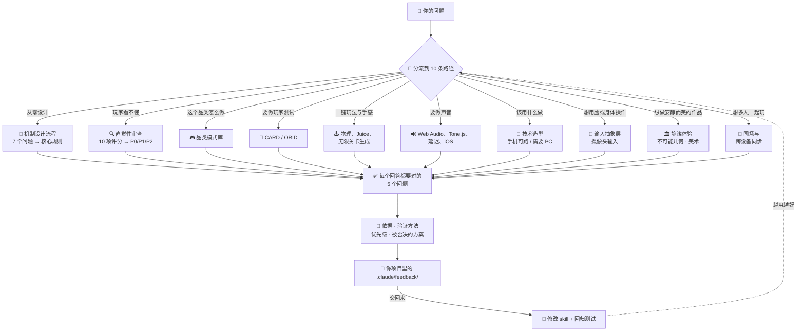

# ⚡ intuitive-game-design

[](https://claude.com/claude-code)
[](.github/workflows/validate-plugin.yml)
[](LICENSE)
[](#-真的有效吗)
[](#-intuitive-game-design)

[English](README.md) · [日本語](README.ja.md) · **简体中文** · [Español](README.es.md) · [한국어](README.ko.md)

> **做一款不用看说明书的游戏 —— 从最初的构思，到它发出的声音。**
>
> 这是一个 Claude Code 插件（包含一个 skill），用于游戏设计、游戏手感和游戏声音。skill 正文是英文；它读取的参考文件目前是日文。日文原版 skill 文本保留在 [`i18n/ja/SKILL.md`](i18n/ja/SKILL.md)。

---

## 🔰 这是什么？

想想一扇门。好的门只靠形状就能告诉你是推还是拉：平板是推，把手是拉。当一扇门需要贴上"推"字，这扇门已经失败了。

游戏也一样。这个 skill 把"我解释一下你就懂了"变成"不用解释就懂"，然后帮你把手感打磨到位，把声音真正做出来。

---

## 📐 系统架构


```mermaid
flowchart TD
    U["👤 你的问题"] --> R{"🧭 分流到 10 条路径"}

    R -->|"从零设计"| A["📐 机制设计流程<br/>7 个问题 → 核心规则"]
    R -->|"玩家看不懂"| B["🔍 直觉性审查<br/>10 项评分 → P0/P1/P2"]
    R -->|"这个品类怎么做"| C["🎮 品类模式库"]
    R -->|"要做玩家测试"| D["🧪 CARD / ORID"]
    R -->|"一键玩法与手感"| E["🕹️ 物理、Juice、<br/>无限关卡生成"]
    R -->|"要做声音"| F["🔊 Web Audio、Tone.js、<br/>延迟、iOS"]
    R -->|"该用什么做"| G["📱 技术选型<br/>手机可跑 / 需要 PC"]
    R -->|"想用脸或身体操作"| H["🎥 输入抽象层<br/>摄像头输入"]
    R -->|"想做安静而美的作品"| I["🏛️ 静谧体验<br/>不可能几何 · 美术"]
    R -->|"想多人一起玩"| J["👥 同场与<br/>跨设备同步"]

    A & B & C & D & E & F & G & H & I & J --> Q["✅ 每个回答都要过的<br/>5 个问题"]
    Q --> O["📄 依据 · 验证方法<br/>优先级 · 被否决的方案"]
    O --> L["📝 你项目里的 .claude/feedback/"]
    L -->|"交回来"| FIX["🔁 修改 skill + 回归测试"]
    FIX -.->|"越用越好"| R
```

---

## ✨ 三大亮点

### 🎯 把"直觉"变成可以核对的东西
5 个问题把一个模糊的词变成明确判断：新玩家能不能在 30 秒内动起来、设计意图和玩家感知在哪里错位、有没有一次塞过 4 个新概念、深度来自元素数量还是来自耦合、三层反馈是否齐全。每个回答都附带依据、验证方法和 P0/P1/P2 优先级。

### 🔧 不只给建议，直接给可运行的实现
Coyote time 和输入缓冲（正确消耗两个计时器的版本）、带解锁与发声数上限和预调度器的 Web Audio 引擎、绝不会生成死局的关卡生成器。这些都是人人重写、人人写错细节的地方。

### 📈 把自己的失败变成回归测试
每次使用会在你项目的 `.claude/feedback/intuitive-game-design.md` 留下 7 行。把这个文件交回来，脚本会把确认的失败转成 eval 用例 —— 修好的问题不会在下次改动中悄悄退回去。

---

## 🔄 使用前 / 使用后

| | 使用前 | 使用后 |
|---|---|---|
| "玩家看不懂" | 把新手引导写得更长 | 找到错位的真正位置，改设计本身 |
| "跳跃手感偶尔不对" | 凭感觉调重力参数 | Coyote time 100–150 ms、输入缓冲 100 ms、可运行代码 |
| "只有 iPhone 没声音" | 没有报错，查几个小时 | 固定的排查顺序，先看 `suspended` 状态 |
| 改进建议 | 列 10 条，一条也没落地 | 点名 P0，写清验证方法 |
| eval 分数 | 66%（不用 skill） | 97% —— 早期 12 个用例版本的历史测量结果；[待重新测量](#-真的有效吗) |

---

## 🚀 安装与使用

**环境要求：** [Claude Code](https://claude.com/claude-code)（或其他能加载 skill 的兼容环境）。只有仓库里的可选脚本需要 Python 3。

### ⭐ 推荐 —— Claude Code 插件市场

在 Claude Code 里执行：

```
/plugin marketplace add takaoumehara/intuitive-game-design-skill
/plugin install intuitive-game-design@intuitive-game-design
```

这样只会安装 skill 本身（`skills/intuitive-game-design/`），不包括 README、eval 和构建产物。

下面几种方式适用于其他环境。

### 🖥️ 方式 A —— 手动安装（CLI / 终端）

克隆一次，用软链接安装 skill 文件夹，改动立即生效：

```bash
git clone https://github.com/takaoumehara/intuitive-game-design-skill.git
ln -s "$(pwd)/intuitive-game-design-skill/skills/intuitive-game-design" ~/.claude/skills/intuitive-game-design
```

如果想直接复制而不是链接：

```bash
git clone https://github.com/takaoumehara/intuitive-game-design-skill.git
cp -r intuitive-game-design-skill/skills/intuitive-game-design ~/.claude/skills/intuitive-game-design
```

### 🧩 方式 B —— AI 集成 IDE

手动安装时，Claude Code 会从两个位置读取 skill。把 `skills/intuitive-game-design/` 里的内容放到其中一个位置；放在项目目录下，可以通过 git 分享给团队：

```bash
# 所有项目都能用
~/.claude/skills/intuitive-game-design/

# 只在当前项目生效，会提交进仓库
<your-project>/.claude/skills/intuitive-game-design/
```

安装后重启 Claude Code。skill 会自动触发，直接说你在做什么就行：

```
我做的手机动作游戏新手引导有 7 屏，30% 的玩家在那里流失
测试的人说跳跃"偶尔没反应"
Chrome 里有声音，iPhone 上一点声音都没有
```

### 🌐 方式 C —— claude.ai（网页版）

从仓库构建压缩包（会把 `skills/intuitive-game-design/` 和 `LICENSE` 打包进一个顶层文件夹）：

```bash
python3 scripts/package.py          # 生成 dist/intuitive-game-design.zip（用 --out <path> 可以输出到别的位置）
```

> 仓库里已提交的 [`dist/intuitive-game-design.zip`](dist/intuitive-game-design.zip) 是在改成插件结构之前构建的，里面仍是只有日文的 skill 文本。在提交新版本之前，请按上面的方法自己重新构建。

1. 在 claude.ai 打开 **Settings → Capabilities**，如果 Skills 菜单是灰的，就打开 **Code execution and file creation**（仅 Free/Pro/Max 需要手动开启，Team 和 Enterprise 默认已开）。
2. 打开 **Settings → Skills → Create skill**。
3. 上传 `dist/intuitive-game-design.zip`。

> claude.ai 只接受 `.zip` 扩展名，压缩包里必须只有一个顶层文件夹，`SKILL.md` 直接放在里面 —— `scripts/package.py` 会按这个结构构建并做检查。

### 🛠️ 方式 D —— 从源码

安装前先确认能跑起来：

```bash
git clone https://github.com/takaoumehara/intuitive-game-design-skill.git
cd intuitive-game-design-skill

claude plugin validate --strict .                                     # 检查市场清单（marketplace manifest）
claude plugin validate --strict .claude-plugin/plugin.json            # 检查插件清单（plugin manifest）
node --check skills/intuitive-game-design/assets/juice-controller.js  # 检查内置实现的语法
python3 scripts/log_summary.py feedback/log.md                        # 确认反馈脚本可运行
```

### 💎 方式 E —— Google Gem（Gemini）

Gem 能附加的知识文件数量很少，**20 多个参考文档无法直接上传。** [`dist/gem/`](dist/gem/) 里放着内容相同、但折叠成少数几个文件的版本。仓库里已提交的 `dist/gem/` 早于英文版 skill 文本，想要最新版本请重新构建。

1. 把 `dist/gem/instructions.md` 的内容粘贴到 Gem 的**说明（Instructions）**栏
2. 把 `dist/gem/split/` 下的 **7 个文件**作为知识上传

若文件数仍超限，改为只上传 `dist/gem/single/` 中的单个文件（内容一致）。若说明栏放不下，换成 `instructions-short.md`。完整步骤见 [`gem/SETUP.md`](gem/SETUP.md)。

```bash
python3 scripts/build_gem.py   # 修改 skill 后重新生成（用 --out <dir> 可以输出到别的位置）
```

### 🔁 边用边改进

每次用完，skill 会往**你项目里**的 `.claude/feedback/intuitive-game-design.md` 追加 7 行 —— 不是写在 skill 文件夹里，因为插件每次更新都会替换那个文件夹。本仓库的 [`feedback/log.md`](feedback/log.md) 是维护者整理的日志。攒几条之后，把你的文件交回来：

> 看这份日志，改进这个 skill

```bash
python3 scripts/log_summary.py path/to/intuitive-game-design.md    # 重复出现的问题、复发的问题
python3 scripts/log_to_eval.py path/to/intuitive-game-design.md    # 失败 → 回归测试
```

最关键的一行是 `Corrected:` —— 你重复说过的话，用你自己的原话记录。如果你说了一遍没被理解，那就是 skill 里缺了一条指令，而这是 skill 唯一无法给自己打分的指标。详见 [`feedback/README.md`](feedback/README.md)。

---

## 📊 真的有效吗

> **状态：待重新测量。** 下面的数字来自**早期 12 个用例 / 64 条断言版本的一次历史测量**。当前 [`evals/evals.json`](evals/evals.json) 里的测试集有 **21 个用例 / 158 条断言**（路径 G–J 是后来加的），还没有重新跑过。那次历史测量的原始回答、评分输出、模型名称和运行日期都**没有提交**，所以无法用这个仓库复现 —— 请把它当作未经验证的过往结果。重新测量时需要提交哪些内容，见 [`evals/README.md`](evals/README.md)。

历史测量：准备了 12 个真实场景的提问，每个回答两次：一次带 skill，一次用同样的模型但不带 skill。评分由独立的第三个模型完成，对照 64 条客观断言。

| 领域 | 带 skill | 不带 skill |
|---|---|---|
| 设计与诊断 | 22/23 | 12/23 |
| 一键玩法与手感 | 17/18 | 12/18 |
| 声音实现 | 23/23 | 18/23 |
| **合计** | **62/64（97%）** | **42/64（66%）** |
| 波动（标准差） | **±7.2 分** | ±28.0 分 |

波动小比平均分高更重要。只是偶尔表现好的东西，没法依赖。

**那次测量中的代价：** token 约 1.9 倍，每次回答多花约 80 秒 —— 因为回答前要先读参考文件。这一项也要重新测量：skill 正文后来翻译成了英文，体积有变化。

**评分过程中发现的问题：** skill 输出过引用用户本地没有的文件的代码、把内部章节编号漏进了面向用户的正文、有一个用例输给了不带 skill 的模型。三个都已修复，并都变成了回归测试，包含在当前的测试集中。老实测量才会发现这些，只看分数它们就一直藏着。

---

## 📁 目录结构

```
.claude-plugin/         plugin.json + marketplace.json（通过 /plugin 安装）
skills/intuitive-game-design/
  SKILL.md              路由器。10 条路径、5 个问题、不可越过的红线（英文）
  references/core/      可供性、MDA、认知负荷、节奏与联觉、输入抽象层、摄像头输入、不可能几何、静谧体验、多人游玩
  references/simple/    一键玩法机制、Juice、跑酷游戏的搭建、程序化生成、经典作品清单
  references/audio/     Web Audio、Tone.js、生成式 AI、平台坑点
  references/web-stack.md    视觉与音频全部技术，按「手机可跑 / 需要 PC」分类
  references/art-pipeline.md 同时拿到美观与轻量
  workflows/            设计流程 · 直觉性审查 · 玩家测试协议（markdown 格式的操作步骤）
  assets/               可运行实现：手感修正、地形生成、音频引擎、音效库
i18n/ja/SKILL.md        日文原版 skill 文本（仅供参考，Claude 不会加载）
feedback/               改进闭环（操作步骤 + 维护者整理的日志）
evals/                  eval 用例（21 个用例 / 158 条断言）和重新测量的要求
scripts/                日志 → 回归测试 · package.py 构建 claude.ai 用的压缩包，build_gem.py 生成 Gem 导出
gem/                    Google Gem 用的说明文本（build_gem.py 输出到 dist/gem/）
dist/                   构建好的 claude.ai 压缩包和 Gem 导出（目前已过时 —— 请重新构建，见上文）
```

`references/` 和 `workflows/` 下的文件目前是日文；Claude 会读取它们，并用你的语言回答。

---

## 📄 许可证

[MIT](LICENSE)
